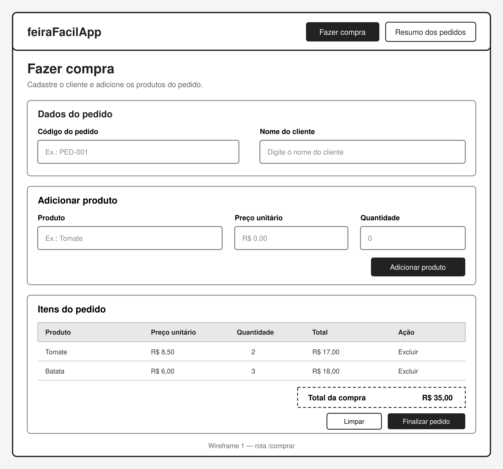
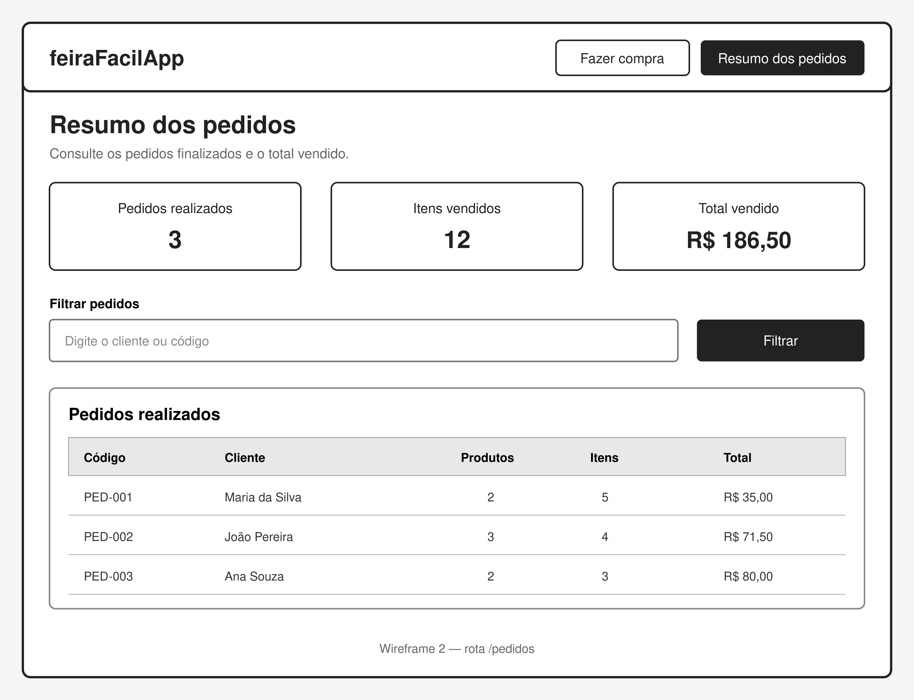

# feiraFacilApp — Sistema de Registro de Pedidos

## Avaliação individual de Desenvolvimento Web 2

O **feiraFacilApp** é uma aplicação desenvolvida com **Vue.js** para registrar e consultar vendas realizadas em uma feira ou sacolão.

Nesta avaliação, você deverá completar as funcionalidades do projeto utilizando os conteúdos trabalhados durante o primeiro e o segundo trimestre.

> **Tempo para realização:** 1 hora e 30 minutos  
> **Modalidade:** individual  
> **Valor:** 10,0 pontos

---

## Objetivo da avaliação

Demonstrar a compreensão dos fundamentos do Vue.js por meio da implementação de um pequeno sistema de pedidos, utilizando:

- variáveis reativas;
- interpolação `{{ }}`;
- `v-model`;
- `v-if` e `v-else`;
- `v-show`;
- `v-for`;
- eventos com `@click`;
- funções JavaScript;
- Vue Router.

O objetivo principal é avaliar a implementação das funcionalidades. A criação do design da aplicação não faz parte da avaliação.

---

## Como iniciar a avaliação

### Pré-requisitos

Antes de começar, verifique se estão instalados:

- Node.js;
- npm;
- Git;
- Visual Studio Code ou outro editor de código.

Para verificar as instalações, execute:

```sh
node --version
npm --version
git --version
```

### 1. Clonar o repositório

```sh
git clone https://github.com/ifc-dev-web2/FeiraFacilApp
```

### 2. Acesse a pasta:

```sh
cd feiraFacilApp
```

### 3. Instalar as dependências

```sh
npm install
```

### 4. Executar o projeto

```sh
npm run dev
```

O terminal mostrará o endereço local da aplicação, na seguinte URL:

```text
http://localhost:5173
```

Abra esse endereço no navegador e mantenha o terminal aberto durante o desenvolvimento.

---

## Estrutura do projeto

```text
feiraFacilApp/
├── docs/
│   ├── feiraFacilApp-fazer-compra.png
│   └── feiraFacilApp-resumo-pedidos.png
├── public/
├── src/
│   ├── assets/
│   │   └── base.css
│   ├── components/
│   │   └── layout/
│   │       └── AppHeader.vue
│   ├── data/
│   │   └── pedidos.js
│   ├── router/
│   │   └── index.js
│   ├── views/
│   │   ├── CompraView.vue
│   │   └── PedidosView.vue
│   ├── App.vue
│   └── main.js
├── .gitignore
├── index.html
├── package.json
├── README.md
└── vite.config.js
```

### Responsabilidade dos principais arquivos

| Arquivo                               | Responsabilidade                                       |
| ------------------------------------- | ------------------------------------------------------ |
| `src/App.vue`                         | Define a estrutura principal da aplicação              |
| `src/components/layout/AppHeader.vue` | Apresenta o cabeçalho e os links de navegação          |
| `src/views/CompraView.vue`            | Página para cadastrar uma nova compra                  |
| `src/views/PedidosView.vue`           | Página para listar e consultar os pedidos              |
| `src/data/pedidos.js`                 | Disponibiliza a lista reativa compartilhada de pedidos |
| `src/router/index.js`                 | Configura as rotas da aplicação                        |
| `src/assets/base.css`                 | Contém os estilos visuais fornecidos                   |
| `docs/`                               | Armazena os wireframes utilizados no README            |

---

## Estrutura fornecida

O projeto-base já possui:

- configuração inicial do Vue.js com Vite;
- arquivos e componentes necessários;
- estilos CSS;
- estrutura visual das páginas;
- configuração inicial do Vue Router;
- links de navegação;
- pedidos iniciais para auxiliar nos testes.

Não será necessário utilizar um framework CSS nem desenvolver um novo layout.

> Você deverá concentrar-se na lógica e nas funcionalidades da aplicação.

| Elemento                       | Situação                      |
| ------------------------------ | ----------------------------- |
| Configuração do Vite           | Pronta                        |
| CSS                            | Pronto                        |
| Estrutura visual               | Pronta ou parcialmente pronta |
| Configuração do Router         | Pronta                        |
| Links de navegação             | Prontos                       |
| Dados reativos dos formulários | Aluno implementa              |
| Diretivas Vue                  | Aluno implementa              |
| Eventos                        | Aluno implementa              |
| Funções e cálculos             | Aluno implementa              |
| Filtro                         | Aluno implementa              |

---

## Cenário

Uma feira precisa de um sistema simples para registrar as compras realizadas pelos clientes.

Cada pedido deverá possuir:

- código do pedido;
- nome do cliente;
- produtos comprados;
- preço unitário de cada produto;
- quantidade adquirida;
- valor total de cada item;
- valor total do pedido.

---

## Rotas da aplicação

| Caminho    | Página             | Finalidade                                             |
| ---------- | ------------------ | ------------------------------------------------------ |
| `/`        | Resumo dos pedidos | Consultar os pedidos finalizados e o resumo das vendas |
| `/comprar` | Fazer compra       | Cadastrar o cliente e os itens de um novo pedido       |
| `/pedidos` | Redirecionamento   | Redirecionar para a página inicial                     |

---

## Wireframes

Os wireframes são uma referência da organização visual. Não é necessário criar um novo design.

### Fazer compra



### Resumo dos pedidos



---

## 1. Página Fazer compra

Nesta página, o usuário deverá informar os dados do pedido e adicionar os produtos comprados pelo cliente.

### Dados do pedido

- código do pedido;
- nome do cliente.

### Dados do produto

- nome do produto;
- preço unitário;
- quantidade.

### Funcionalidades obrigatórias

1. Utilizar `v-model` nos campos do formulário.
2. Adicionar um produto ao pedido.
3. Exibir os produtos adicionados.
4. Calcular o valor total de cada item.
5. Excluir um produto do pedido.
6. Calcular o valor total da compra.
7. Finalizar e armazenar o pedido.
8. Limpar os campos depois que o pedido for finalizado.

### Cálculos

```text
total do item = preço unitário × quantidade
```

O valor total do pedido deverá corresponder à soma dos totais de todos os itens adicionados.

### Validações

Um produto somente poderá ser adicionado quando:

- o nome do produto estiver preenchido;
- o preço unitário for maior que zero;
- a quantidade for maior que zero.

O pedido somente poderá ser finalizado quando:

- o código do pedido estiver preenchido;
- o nome do cliente estiver preenchido;
- houver pelo menos um produto adicionado.

Utilize `v-if`, `v-else` ou `v-show` para apresentar mensagens ao usuário.

---

## 2. Página Resumo dos pedidos

Nesta página, deverão ser apresentados os pedidos finalizados.

### Informações de cada pedido

- código do pedido;
- nome do cliente;
- quantidade de produtos diferentes;
- quantidade total de itens;
- valor total da compra.

### Funcionalidades obrigatórias

1. Listar os pedidos registrados.
2. Filtrar os pedidos pelo nome do cliente ou pelo código.
3. Apresentar uma mensagem quando nenhum pedido for encontrado.
4. Exibir o resumo geral das vendas.

### Resumo geral

O resumo deverá apresentar:

- total de pedidos realizados;
- total de itens vendidos;
- valor total vendido pela feira.

Exemplo:

```text
Pedidos realizados: 3
Itens vendidos: 12
Total vendido: R$ 186,50
```

---

## Estrutura dos dados

O arquivo `src/data/pedidos.js` contém pedidos iniciais para auxiliar no desenvolvimento e nos testes. Novos pedidos deverão ser adicionados à mesma lista reativa.

```js
import { ref } from 'vue'

export const pedidos = ref([
  {
    codigo: 'PED-001',
    cliente: 'Maria da Silva',
    itens: [
      {
        id: 1,
        produto: 'Tomate',
        precoUnitario: 8.5,
        quantidade: 2,
      },
      {
        id: 2,
        produto: 'Batata',
        precoUnitario: 6,
        quantidade: 3,
      },
    ],
  },
])
```

Para utilizar a lista compartilhada em uma página:

```js
import { pedidos } from '@/data/pedidos'
```

Os valores totais não precisam ser armazenados nos objetos. Eles deverão ser calculados a partir do preço unitário e da quantidade.

> Os dados permanecem somente na memória e podem ser perdidos quando a página for atualizada.

---

## Critérios de avaliação

| Critério                                            | Pontuação |
| --------------------------------------------------- | --------: |
| Uso de variáveis reativas, `v-model` e interpolação |       1,5 |
| Adição e exibição dos produtos                      |       1,5 |
| Exclusão dos produtos                               |       0,5 |
| Cálculo do total de cada item e do pedido           |       1,5 |
| Validações e diretivas condicionais                 |       1,0 |
| Finalização e armazenamento dos pedidos             |       1,5 |
| Listagem e filtro dos pedidos                       |       1,0 |
| Indicadores do resumo geral                         |       1,0 |
| Funcionamento das duas rotas                        |       0,5 |
| **Total**                                           |  **10,0** |

---

| Critério Complementar   |                                                             Regra |
| ----------------------- | ----------------------------------------------------------------: |
| Compreensão e autoria   | O estudante deverá explicar as principais partes da implementação |
| Alteração prática       |              O professor poderá solicitar uma pequena modificação |
| Código não compreendido |      A funcionalidade correspondente poderá não receber pontuação |

---

## Orientações importantes

- A avaliação deverá ser realizada individualmente.
- Não será avaliada a criação de CSS ou de um novo design.
- Utilize os estilos e a estrutura visual fornecidos no projeto-base.
- Não é necessário consumir uma API.
- Não é necessário utilizar `localStorage` ou banco de dados.
- Não altere a estrutura dos objetos fornecidos em `src/data/pedidos.js`.
- Teste cada funcionalidade antes de entregar.
- A aplicação não deverá apresentar erros no console do navegador.
- A pasta `node_modules` não deverá ser enviada ao repositório.

---

## Comandos disponíveis

| Comando         | Finalidade                              |
| --------------- | --------------------------------------- |
| `npm install`   | Instalar as dependências                |
| `npm run dev`   | Executar em ambiente de desenvolvimento |
| `npm run build` | Gerar a versão de produção              |
| `npm run lint`  | Verificar o código                      |

---

## Entrega

Antes de entregar, verifique se:

- [ ] é possível informar o cliente e o código do pedido;
- [ ] é possível adicionar produtos;
- [ ] os produtos adicionados aparecem na tabela;
- [ ] o total de cada item está correto;
- [ ] é possível excluir um produto;
- [ ] o valor total da compra está correto;
- [ ] é possível finalizar um pedido;
- [ ] os campos são limpos depois da finalização;
- [ ] os pedidos aparecem na página de resumo;
- [ ] o filtro funciona pelo cliente ou pelo código;
- [ ] os indicadores gerais apresentam valores corretos;
- [ ] as páginas podem ser acessadas pelos links de navegação;
- [ ] não existem erros no console do navegador.

### Envio pelo Git

```sh
git status
git add .
git commit -m "Finaliza avaliação feiraFacilApp"
git push
```

Ao final, execute novamente `git status`, confirme que todas as alterações foram registradas e envie o link do repositório no local indicado pelo professor.

---

## Resultado esperado

Ao final da avaliação, a aplicação deverá permitir registrar uma compra com vários produtos e consultar um resumo dos pedidos realizados e das vendas da feira.

## Uso de Inteligência Artificial

Esta é uma avaliação individual destinada a verificar a compreensão dos conteúdos fundamentais de Vue.js trabalhados durante o primeiro e o segundo trimestre.

Durante a realização da avaliação, não será permitido utilizar ferramentas de Inteligência Artificial generativa para produzir, completar, corrigir ou explicar o código da atividade.

Isso inclui, entre outras:

- ChatGPT;
- GitHub Copilot;
- Gemini;
- Claude;
- DeepSeek;
- extensões de IA instaladas no editor;
- geradores automáticos de código;
- compartilhamento de soluções entre colegas.

O preenchimento automático convencional do editor, como sugestões de nomes de arquivos, propriedades e fechamento de tags, poderá ser utilizado. Entretanto, ferramentas que gerem funções, componentes ou blocos completos de código não serão permitidas.

Será permitida a consulta aos seguintes materiais:

- conteúdos disponibilizados pelo professor;
- códigos desenvolvidos anteriormente em aula;
- documentação oficial do Vue.js;
- documentação oficial do JavaScript;
- anotações pessoais do estudante.

O estudante deverá compreender e ser capaz de explicar todo o código entregue.

O professor poderá solicitar que o estudante:

- explique uma variável, diretiva ou função utilizada;
- demonstre o funcionamento de uma funcionalidade;
- realize uma pequena alteração no código;
- corrija um comportamento durante a apresentação;
- explique como o valor total ou o filtro foi implementado.

Caso o estudante não consiga explicar ou modificar o código apresentado, a funcionalidade poderá não ser considerada na avaliação.

O uso não autorizado de Inteligência Artificial ou de código produzido por terceiros será tratado conforme as orientações acadêmicas da instituição.

Caso o estudante não consiga explicar ou modificar o código apresentado, a funcionalidade poderá não ser considerada na avaliação.

## Declaração de autoria

Ao entregar esta atividade, declaro que:

- [x] desenvolvi individualmente a solução apresentada;
- [x] não utilizei ferramentas de Inteligência Artificial generativa;
- [x] não copiei código de outros estudantes;
- [x] compreendo o código entregue;
- [x] estou apto a explicar e modificar a minha implementação.
